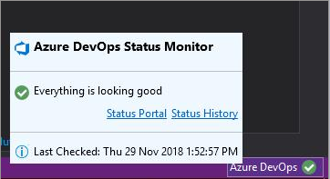
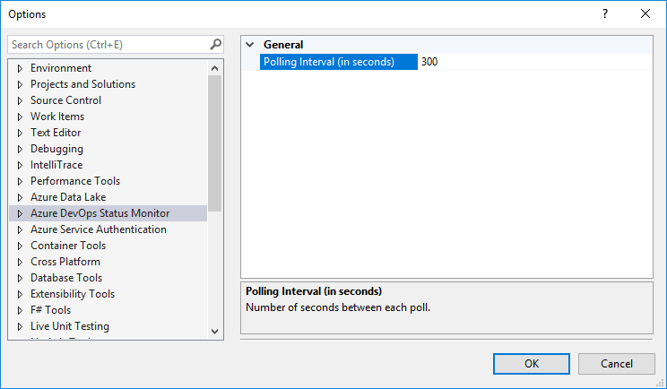

# Azure DevOps Status Monitor

The simple extension quietly sits in the Visual Studio status bar displaying Azure DevOps Service status. You can click on the icon on the Visual Studio status bar to view more details. 

By default it fetches the status every 5 minutes, but you can configure it under `Tools | Options` in Visual Studio.

## Troubleshoot

[Issue: Status icon not visible in the status bar](https://github.com/onlyutkarsh/VSOStatusInspector/issues/1) 

- Go to `Tools` -> `Options`
- Under `Environment` -> `General` category, ensure you have checked `Enable rich client visual experience`

 
## Facing issues?
Please [raise a issue](https://github.com/onlyutkarsh/VSOStatusInspector/issues/new) and I will try my best to address and fix the issue.

Alternatively you can contribute the fix by making a pull request :-)

## Release history

> **v1.4**
> - Changed the name to Azure DevOps Status Monitor
> - Uses the new Azure DevOps Service Status portal API
> - UI Improvements to show rich icons
> - Changes to support upcoming VS 2019
> - Load the package asynchronously, resulting in Visual Studio to load faster.
> 
> **v1.3**
> - Support for VS 2017
> - Updated logic to fetch the status
> - Removed support for VS 2013. If you still using VS 2013 and need this extension, use the VSIX from [here](https://github.com/onlyutkarsh/VSOStatusInspector/releases/tag/1.2)
>
> **v1.2**
> - Thanks to [@stebueh](https://github.com/stebueh), the parsing logic is now fixed and status is updated correctly.
> - Changed the name of extension to VSTS Status Inspector.
> 
> **v1.1**
> - Update the timer interval immediately rather than waiting for a VS restart
> - Handle exceptions when unable to connect to support page.